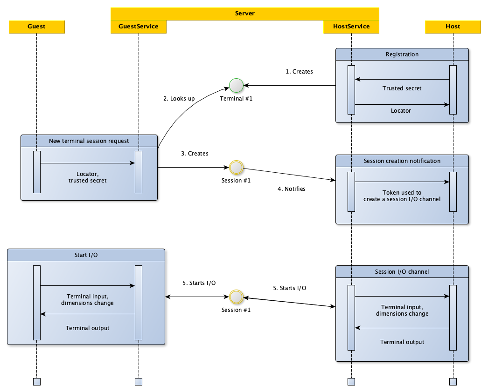

# Cirrus Terminal

A service that powers [Cirrus CI](https://cirrus-ci.org/)'s task terminal access.

It's used as follows:

* `pkg/host` package is used in the [Cirrus CI agent](https://github.com/cirruslabs/cirrus-ci-agent) and acts as a terminal host
* `internal/server` is running in the cloud and provides the server functionality
* [Cirrus CI web frontend](https://github.com/cirruslabs/cirrus-ci-web) acts as a terminal guest

## Architecture

The whole system consists of three components:

* `host` — provides terminal sessions by registering itself on the `server`
  * currently works over gRPC
* `server` — acts as a rendezvous point between `host ` and `guest `
* `guest` — connects to the `hosts` through a `server` and consumes terminal sessions
  * currently works over gRPC-Web, however, in the future, it's technically possible to provide an ability to connect to the `hosts` via `server` using a standard SSH client

The most up-to-date protocol specification can be found in the [`terminal.proto`](proto/terminal.proto), but to give a bit more visual picture, the overall data flow looks like this:



## Development

Development is done as you'd do normally, however, in case you need to make [`terminal.proto`](proto/terminal.proto) changes, you will need re-generate the `internal/api` package contents.

To do this, make sure that both [Protocol Buffers Compiler](https://grpc.io/docs/protoc-installation/) (`protoc`) and Go-specific plugins are installed: 

```sh
go install google.golang.org/protobuf/cmd/protoc-gen-go
go install google.golang.org/grpc/cmd/protoc-gen-go-grpc
```

And then run the following command from the root of the project:

```
buf generate
```

The JavaScript stubs are generated automatically by the `JavaScript Protocol Buffers and gRPC code-generation` task in the [`.cirrus.yml`](.cirrus.yml).
